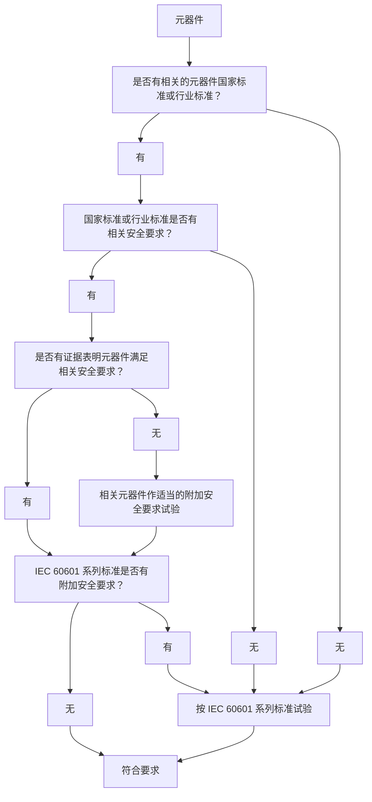
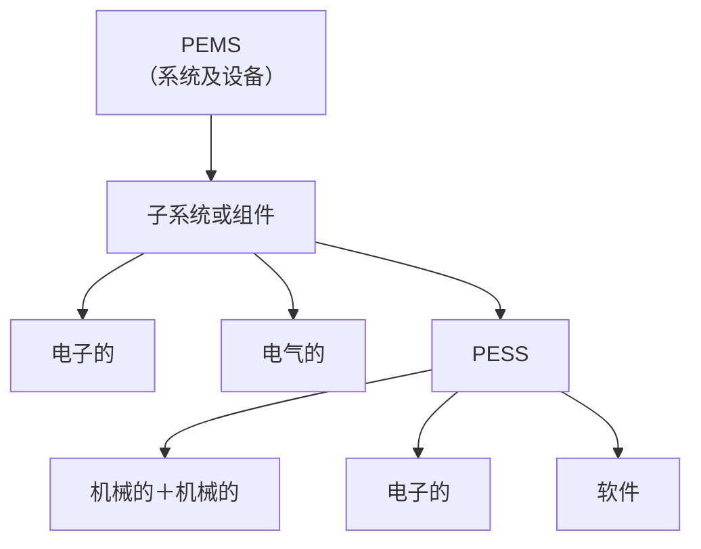
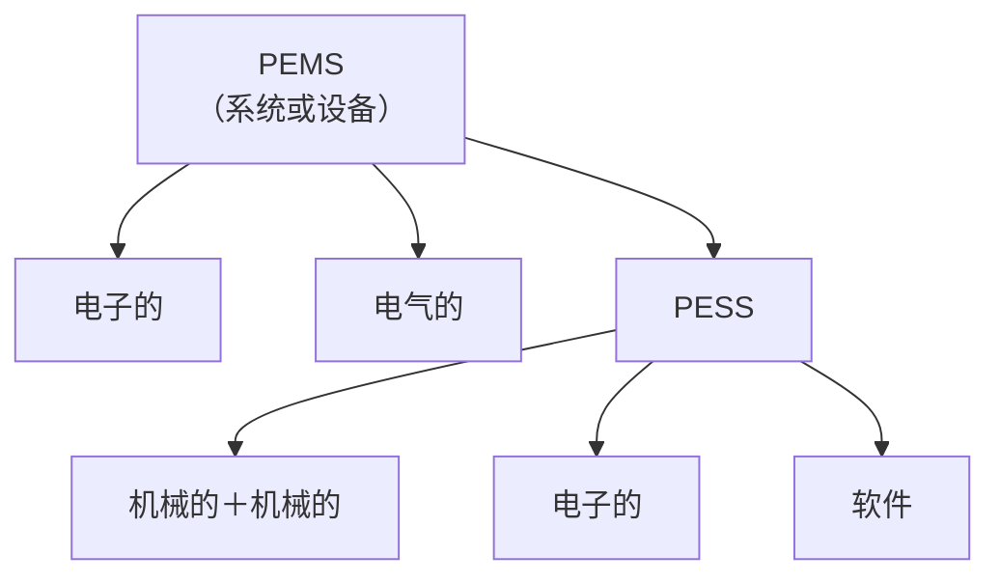
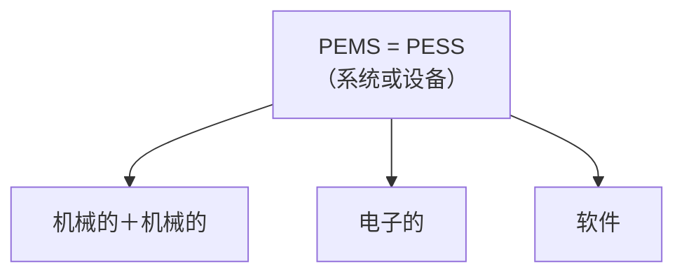

**GB 9706.1-2020是医用电气设备的基本安全和基本性能通用要求标准，自2023年5月1日起实施，对医疗器械注册、备案和检验提出了明确要求。**

# 术语

| 术语 | 英文 |
|---|---|
| 调节孔盖 | access cover |
| 可触及部分 | accessible part |
| 附件 | accessory |
| 随附文件 | accompany document |
| 电气间隙 | air clearance |
| 器具耦合器 | appliance coupler |
| 器具插入插座 | appliance inlet |
| 应用部分 | applied part |
| 基本绝缘 | basic insulation |
| 基本安全 | basic safety |
| AP型 | category AP |
| APG型 | category APG |
| Ⅰ类 | class Ⅰ |
| Ⅱ类 | class Ⅱ |
| 清晰易认 | clearly legible |
| 冷态 | cold condition |
| 高完善性元器件 | component with high-integrity characteristic |
| 连续运行 | continuous operation |
| 爬电距离 | creepage distance |
| 防除颤应用部分 | defibrillation-proof applied part |
| 可拆卸电源软电线 | detachable power supply cord |
| 直接用于心脏 | direct cardiac application |
| 双重绝缘 | double insulation |
| 持续周期 | duty cycle |
| 对地漏电流 | earth leakage current |
| 外壳 | enclosure |
| 基本性能 | essential performance |
| 预期使用寿命 | expected service life |
| F型隔离（浮动）部分 | F-type isolated (floating) applied part |
| 固定的 | fixed |
| 与空气混合的易燃麻醉气 | flammable anaesthetic mixture with air |
| 与氧或氧化亚氮混合的易燃麻醉气 | flammable anaesthetic mixture with oxygen or nitrous oxide |
| 功能连接 | functional connection |
| 功能接地导线 | functional earth conductor |
| 功能接地端子 | functional earth terminal |
| 防护件 | guard |
| 手持的 | hand-held |
| 伤害 | harm |
| 危险（源） | hazard |
| 危险情况 | hazardous condition |
| 高电压 | high voltage |
| 水压试验压力 | hydraulic test pressure |
| 绝缘配合 | insulation co-ordination |
| 预期用途 & 预期目的 | intended use & intended purpose |
| 内部电源 | internal electrical power source |
| 内部供电 | internally powered |
| 漏电流 | leakage current |
| 网电源连接器 | mains connector |
| 网电源部分 | mains part |
| 网电源插头 | mains plug |
| 网电源变压器 | mains supply transformer |
| 网电源接线端子装置 | mains terminal device |
| 网电源瞬时电压 | mains transient voltage |
| 网电源电压 | mains voltage |
| 制造商 | manufacturer |
| 最高网电源电压 | maximum mains voltage |
| 最大容许工作压力 | maximum permissible working pressure |
| 对操作者的防护措施 | means of operator protection(MOOP) |
| 对患者的防护措施 | means of patient protection(MOPP) |
| 防护措施 | means of protection |
| 机械危险 | mechanical hazard |
| 机械保护装置 | mechanical protective device |
| **医用电气设备 & ME设备** | **medical electrical equipment & ME equipment** |
| **医用电气系统（ME系统）** | **medical electrical system** |
| 移动的 | mobile |
| 型号或类型参考号 | model or type reference |
| 多位插座 | multiple socket-outlet(MSO) |
| 网络/数据耦合 | network/data coupling |
| 标称（值） | nominal(value) |
| 正常状态 | normal condition |
| 正常使用 | normal use |
| 客观证据 | objective evidence |
| 操作者 | operator |
| 过流释放器 | over-current release |
| 富氧环境 | oxygen rich environment |
| 患者 | patient |
| 患者辅助电流 | patient auxiliary current |
| 患者连接 | patient connection |
| 患者环境 | patient environment |
| 患者漏电流 | patient leakage current |
| 峰值工作电压 | perk working voltage |
| PEMS开发生命周期 | PEMS development life-cycle |
| PEMS确认 | PEMS validation |
| 永久性安装 | permanently installed |
| 可携带的 | portable |
| 电位均衡导线 | potential equalization conductor |
| 电源软导线 | potential equalization conductor |
| 程序 | procedure |
| 过程 | process |
| **可编程医用电气系统** | programmable electrical medical system(PEMS) |
| **可编程电子子系统** | programmable electrical subsystem(PESS) |
| 正确安装 | properly installed |
| 保护接地导线 | protective earth conductor |
| 保护接地连接 | protective earth connection |
| 保护接地端子 | protective earth terminal |
| 保护接地 | protectively earthed |
| 额定（值） | rated (value) |
| 记录 | record |
| 加强绝缘 | reinforced insulation |
| 剩余风险 | residual risk |
| 责任方 | responsible organization |
| 风险 | risk |
| 风险分析 | risk analysis |
| 风险评定 | risk assessment |
| 风险控制 | risk control |
| 风险评价 | risk evaluation |
| 风险管理 | risk management |
| 风险管理文档 | risk management file |
| 安全工作载荷 | safe working load |
| 次级电路 | secondary circuit |
| 自动复位热断路器 | self-resetting thermal cut-out |
| 隔离装置 | separation device |
| 维护人员 | service personnel |
| 严重度 | severity |
| 信号输入/输出部分 | signal input/output part(SIP/SOP) |
| 单一故障状态 | single fault condition |
| 单一故障安全 | single fault safe |
| 非移动的 | stationary |
| 附加绝缘 | supplementary insulation |
| 供电网 | supply mains |
| 拉伸安全系数 | tensile safety factor |
| 拉伸强度 | tensile strength |
| 接线端子装置 | terminal device |
| 热断路器 | thermal cut-out |
| 热稳态 | thermal stability |
| 温控器 | thermostat |
| 工具 | tool |
| 总载荷 | total load |
| 接触电流 | touch current |
| 可转移的 | transportable |
| 俘获区域 | trapping zone |
| B型应用部分 | type B applied part |
| BF型应用部分 | type BF applied part |
| CF型应用部分 | type CFapplied part |
| 型式试验 | type test |
| 可用性 | usability |
| 可用性工程 | usability engineering |
| 验证 | verification |
| 工作电压 | working voltage |
| 空气比释动能 | air kerma |
| 报警状态 | alarm condition |
| 报警信号 | alarm signal |
| 报警系统 | alarm system |
| 可穿戴的 | body-worn |
| IT-网络 & 信息技术网络 | IT-network & information technology network |
| 主要操作功能 | primary operating function |
| 可用性工程文档 | usability engineering file |

# 简称

|缩略语/简称|术语|英文全称|简单解释|
|-|-|-|-|
|a.c.|交流|alternating current|交流，指大小和方向随时间周期性变化的电流。|
|AEL|可发射极限|Accessible Emission Limit|可发射极限，指激光产品在规定条件下允许发射的最大辐射量。|
|AMSO|辅助网电源插座|Auxiliary Mains Socket-Outlet|辅助网电源插座，用于向其他设备供电的附加插座。|
|AP|麻醉防护|Anaesthesia-proof|麻醉防护，指设备适用于存在易燃麻醉混合气体的环境。|
|APG|麻醉防护类型G（气体）|Anaesthesia-proof Category G|麻醉防护类型G（气体），适用于与空气混合的易燃麻醉气体的设备类别。|
|CASE|计算机辅助软件工程|Computer Aided Software Engineering|计算机辅助软件工程，使用软件工具辅助系统开发和维护的方法。|
|CAT|计算机辅助断层扫描|Computed Axial Tomography|计算机辅助断层扫描，利用X射线对物体进行断层成像的技术。|
|CRT|阴极射线管|Cathode Ray Tube|阴极射线管，利用电子束轰击荧光屏成像的显示器件。|
|CTI|相比漏电起痕指数|Comparative Tracking Index|相比漏电起痕指数，衡量绝缘材料耐漏电起痕性能的参数。|
|d.c.|直流|Direct Current|直流，方向不随时间变化的电流。|
|DICOM|医学数字成像与通讯|Digital Imaging and Communications in Medicine|医学数字成像与通讯，用于医学影像存储、传输与共享的国际标准。|
|ECG|心电图|Electrocardiogram|心电图，记录心脏电活动随时间变化的曲线。|
|ELV|特低电压|Extra Low Voltage|特低电压，电压不超过特定限值的低电压等级。|
|EUT|被测设备|Equipment Under Test|被测设备，正在进行测试或需要接受测试的设备。|
|FDDI|光纤分布式数据接口|Fiber Distributed Data Interface|光纤分布式数据接口，基于光纤的高速局域网标准。|
|FMEA|失效模式及影响分析|Failure Mode and Effects Analysis|失效模式及影响分析，系统分析潜在失效模式及其影响的可靠性方法。|
|FV|易燃性分类|Flammability Value|易燃性分类，对材料燃烧性能进行分级的方法。|
|HL7|卫生信息交换标准（Health Level 7）|Health Level 7|卫生信息交换标准，用于医疗信息系统之间数据交换的标准协议。|
|IIBP|有创血压导管|Invasive Blood Pressure|有创血压导管，通过插入血管内的导管直接测量血压的方式。|
|ICRP|国际放射防护委员会|International Commission on Radiological Protection|国际放射防护委员会，制定辐射防护原则和建议的国际机构。|
|IEV|国际电工词汇|International Electrotechnical Vocabulary|国际电工词汇，IEC发布的电工电子术语标准。|
|IP|互联网协议|Internet Protocol|互联网协议，用于在网络中传输数据包的核心协议。|
|IPS|隔离电源|Isolated Power Supply|隔离电源，与供电电源电气隔离的电源系统。|
|IT|信息技术|Information Technology|信息技术，用于处理、存储和传输信息的计算机与通信技术。|
|LDAP|轻量目录访问协议|Lightweight Directory Access Protocol|轻量目录访问协议，用于访问和维护目录服务信息的应用层协议。|
|LED|发光二极管|Light Emitting Diode|发光二极管，通电后发光的半导体器件。|
|MAR|最小角度解析|Minimum Angle of Resolution|最小角度解析，人眼或光学系统能分辨的最小角度。|
|MD|测量装置|Measuring Device|测量装置，用于测量物理量并给出测量值的装置。|
|ME|医用电气|Medical Electrical|医用电气，用于诊断、治疗或监护患者且由电源供电的设备。|
|MOOP|对操作者的防护措施|Means of Operator Protection|对操作者的防护措施，防止操作者受到电击等伤害的隔离措施。|
|MOP|防护措施|Means of Protection|防护措施，为降低风险而采取的隔离、接地等措施。|
|MOPP|对患者的防护措施|Means of Patient Protection|对患者的防护措施，防止患者受到电击等伤害的隔离措施。|
|MPSO|可移动式多位插座|Multiple Portable Socket-Outlet|可移动式多位插座，可移动且具有多个插孔的插座装置。|
|MSO|多位插座|Multiple Socket-Outlet|多位插座，具有多个插孔的固定插座装置。|
|**PEMS**|可编程医用电气系统|Programmable Electrical Medical System|可编程医用电气系统，包含可编程电子子系统的医用电气设备或系统。|
|PESS|可编程电子子系统|Programmable Electronic Subsystem|可编程电子子系统，基于可编程电子器件实现功能的子系统。|
|PTC|正温度系数装置|Positive Temperature Coefficient|正温度系数装置，电阻随温度升高而增大的保护元件。|
|PTFE|聚四氟乙烯|Polytetrafluoroethylene|聚四氟乙烯，耐高温、耐腐蚀的氟塑料材料。|
|PVC|聚氯乙烯|Polyvinyl Chloride|聚氯乙烯，常用的绝缘和护套塑料材料。|
|RFID|射频识别|Radio Frequency Identification|射频识别，利用无线电波自动识别目标并读取数据的技术。|
|r.m.s.|均方根|Root Mean Square|均方根，交流信号有效值的计算方法。|
|SAR|特定吸收率|Specific Absorption Rate|特定吸收率，人体组织单位质量吸收的电磁能量速率。|
|SELV|安全特低电压|Safety Extra Low Voltage|安全特低电压，在正常和单一故障条件下均不超过限值的低电压。|
|SI|国际单位制|International System of Units|国际单位制，国际通用的计量单位体系。|
|SIP/SOP|信号输入/输出部分|Signal Input Part / Signal Output Part|信号输入/输出部分，ME设备中用于接收或发送信号的部件。|
|TCP|传输连接协议|Transmission Control Protocol|传输控制协议，面向连接的可靠传输层协议。|
|TENS|经皮电子神经刺激器|Transcutaneous Electrical Nerve Stimulator|经皮电子神经刺激器，通过皮肤施加电脉冲缓解疼痛的设备。|
|TEF|四氟乙烯|Tetrafluoroethylene|四氟乙烯，用于合成聚四氟乙烯的单体。|
|UPS|不间断电源|Uninterruptible Power Supply|不间断电源，市电中断时继续为负载供电的设备。|
|VDU|视频显示单元|Visual Display Unit|视频显示单元，用于显示文字和图像的显示器设备。|

# 元器件合格性流程图

# PEMS/PESS

## 复杂系统示例

## 较为简单系统示例

## 最简单系统示例

## 设计和实现

应用**开发生命周期**模型时，设计和实现可以包含下列选择：

1. 设计环境，例如：
    - 软件开发方法；
    - 计算机辅助软件工程（CASE）工具；
    - 编程语言；
    - 硬件和软件开发平台；
    - 仿真工具；
    - 设计和编码标准；
2. 电子元器件；
3. 硬件冗余；
4. 人-**PEMS**接口；
5. 能量源；
6. 环境条件；
7. 第三方软件；
8. 网络选项。

这些设计环境的要素，既可用通用的方式，也可用它们在设计和实现**过程**中的特殊方式表征。

