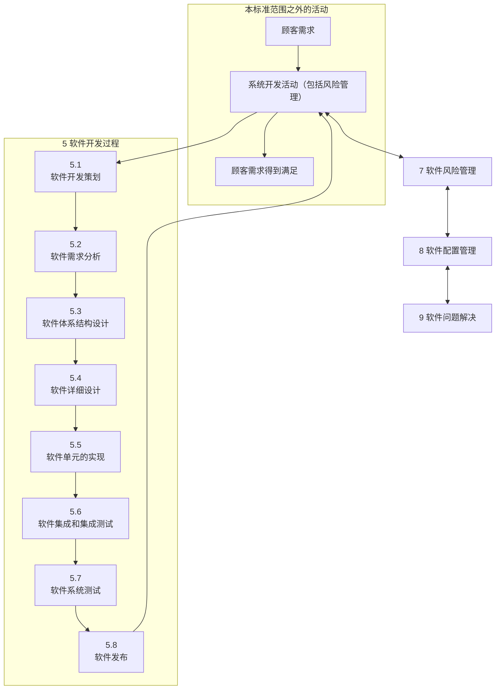
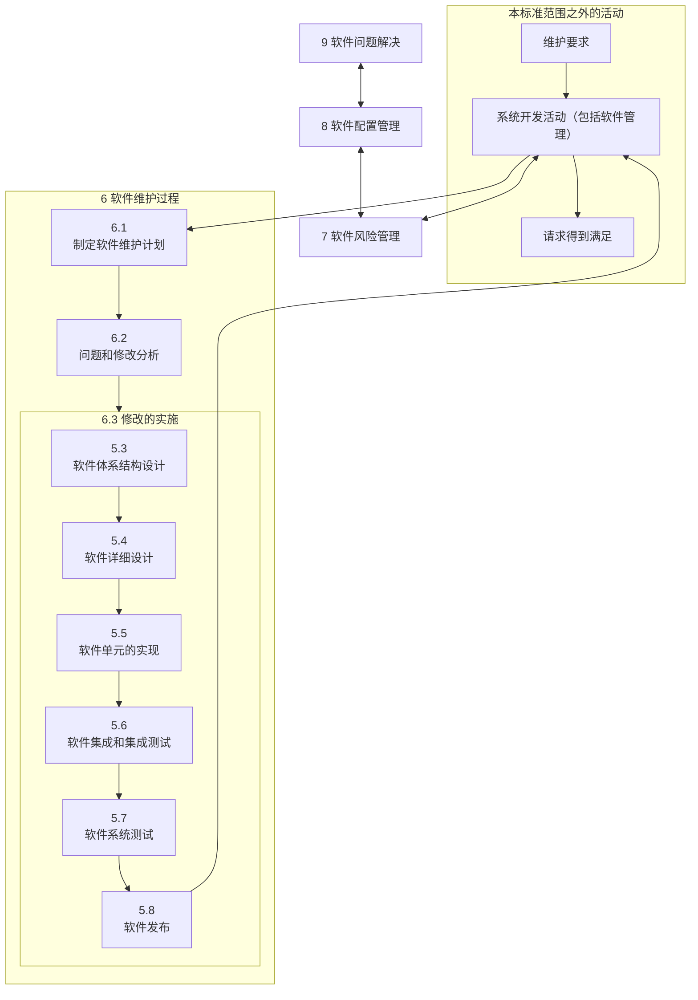
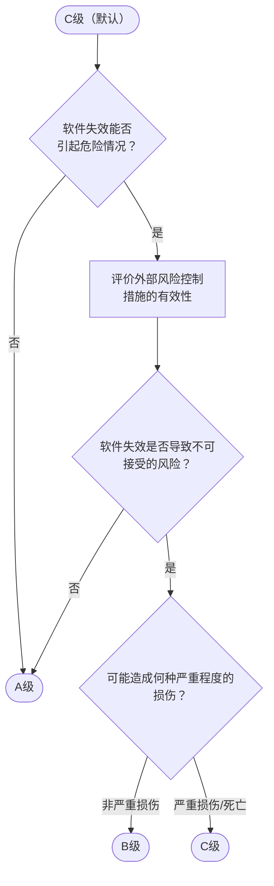

# 软件开发过程和活动图示

# 软件维护过程和活动图示

# 术语

| 术语 | 英文 |
|---|---|
| 活动 | activity |
| 反常 | anomaly |
| 体系结构 | architecture |
| 变更请求 | change request |
| 配置项 | configuration item |
| 交付物 | deliverable |
| 评价 | evaluation |
| 伤害 | harm |
| 危险（源） | hazard |
| 制造商 | manufacturer |
| 医疗器械软件 | medical device software |
| 问题报告 | problem report |
| 过程 | process |
| 回归测试 | regression testing |
| 风险 | risk |
| 风险分析 | risk analysis |
| 风险控制 | risk control |
| 风险管理 | risk management |
| 风险管理文档 | risk management file |
| 安全 | safety |
| 信息安全 | security |
| 严重损伤 | serious injury |
| 软件开发生存周期模型 | software development life cycle model |
| 软件项 | software item |
| 软件系统 | software system |
| 软件单元 | software unit |
| 未知来源软件 | software of unknown provenance(SOUP) |
| 系统 | system |
| 任务 | task |
| 可追溯性 | traceability |
| 验证 | verification |
| 版本 | version |
| 危险情况 | hazardous situation |
| 遗留软件 | legacy software |
| 发布 | release |
| 剩余风险 | residual risk |
| 风险估计 | risk evaluation |
| 风险评价 | risk evaluation |

# 赋予软件安全级别

