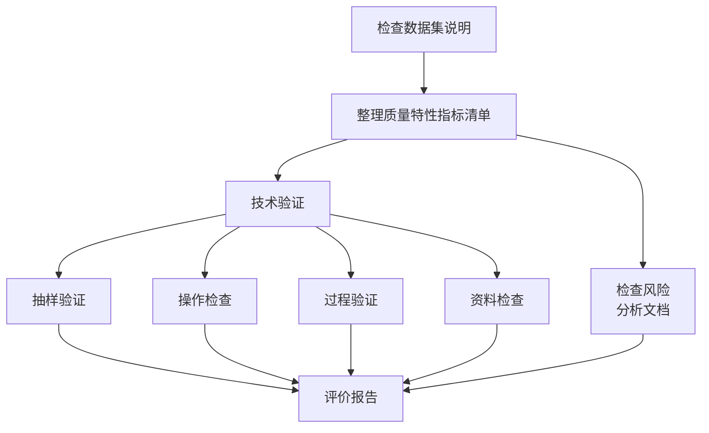

# 术语

## 1 基础技术术语

| 术语 | 英文 |
|---|---|
| 人工智能 | artificial intelligence(AI) |
| 人工智能医疗器械 | artificial intelligence medical device(AIMD) |
| 医疗器械软件 | medical device software |
| 模式识别 | pattern recognition |
| 人工神经网络 | artificial neural network(ANN) |
| 推理 | inference |
| 特征 | feature |
| 机器学习 | machine learning |
| 深度学习 | deep learning |
| 监督学习 | supervised learning |
| 无监督学习 | unsupervised learning |
| 强化学习 | reinforcement learning |
| 半监督学习 | semi-supervised learning |
| 自监督学习 | self-supervised learning |
| 弱监督学习 | weakly supervised learning |
| 集成学习 | ensemble learning |
| 主动学习 | active learning |
| 迁移学习 | transfer learning |
| 联邦学习 | federated learning |
| 训练 | training |
| 交叉验证 | cross validation |
| 过拟合 | overfitting |
| 欠拟合 | underfitting |
| 前馈网络 | feedforward network |
| 反向传播网络 | back-propagation network |
| 前馈传播 | feedforward propagation |
| 反馈传播 | feedback propagation |
| 医学知识库 | medical knowledgebase |
| 算法服务 | algorithm service |
| 云服务 | cloud service |
| 边缘云服务 | edge cloud service |
| 本地服务 | local service |
| 人工智能医疗器械生存周期模型 | AIMD lifecycle model |

## 2 数据集术语

### 2.1 第一部分

| 术语 | 英文 |
|---|---|
| 数据 | data |
| 个人敏感数据 | personal sensitive data |
| 健康数据 | health data |
| 缺失数据 | missing data |
| 数据元 | data element |
| 元数据 | metadata |
| 数据质量 | data quality |
| 数据集 | data set |
| 训练集 | training set |
| 调优集 | tuning set |
| 测试集 | testing set |
| 数据生存周期 | data life cycle |
| 数据集偏倚 | dataset bias |
| 数据质量特性 | data quality characteristic |
| 数据层次 | data stratification |
| 参考标准 | reference standard |
| 金标准 | gold standard |
| GT 值 | ground truth(GT) |
| 数据清洗 | data cleaning |
| 数据治理 | data governance |
| 数据挖掘 | data mining |
| 数据标签 | data label |
| 数据采集 | data acquisition |
| 数据脱敏 | data masking |
| 匿名化 | anonymization |
| 去标识化 | de-identification |
| 数据标注 | data annotation |
| 仲裁 | arbitration |
| 图像 | image |
| 图形 | graphic |
| 文本 | text |
| 数值 | numerical value |
| 音频 | audio |
| 视频 | video |
| 多媒体 | multimedia |

### 2.2 第二部分

| 术语 | 英文 |
|---|---|
| 计数检验 | inspection by attributes |
| 计算质量特性 | variable quality characteristic |
| 计量抽样实验 | sampling inspection by variable |
| 批 | lot |
| 准确度 | accuracy |
| 精度 | precision |
| 一致性 | consistency |
| 可得性 | availability |
| 信息安全性 | information security |
| 可移植性 | portability |
| 数据集制造责任方 | dataset manufacture responsible organization |
| 离群值 | outlier |
| 数据集说明 | dataset description |

## 3 质量特性术语

| 术语 | 英文 |
|---|---|
| 软件质量 | software quality |
| 软件质量保证 | software quality assurance |
| 性能 | performance |
| 性能评价 | performance evaluation |
| 可靠性 | reliability |
| 完整性 | integrity |
| 一致性 | consistency |
| 重复性 | repeatability |
| 再现性 | reproducibility |
| 可达性 | accessibility |
| 可得性 | availability |
| 保密性 | confidentiality |
| 网络安全 | cybersecurity |
| 安全性 | safety |
| 健壮性 | robustness |
| 泛化能力 | generalizability |
| 响应时间 | response time |
| 可追溯性 | traceability |
| 公平性 | fairness |
| 可解释性 | explainability |

## 4 质量评价术语

### 4.1 评价方式

| 术语 | 英文 |
|---|---|
| 性能测试 | performance testing |
| 独立性能测试 | standalone performance testing |
| 判读者性能测试 | reader performance testing |
| 多判读者多病例研究 | multi-reader multi-case study |
| 黑盒测试 | black-box testing |
| 白盒测试 | glass-box testing |
| 对抗(措施) | countermeasure |
| 对抗样本 | adversarial sample |
| 对抗测试 | adversarial test |

### 4.2 评价指标

| 术语 | 英文 |
|---|---|
| 阳性样本 | positive sample |
| 阴性样本 | negative sample |
| 真阳性 | true positive(TP) |
| 假阳性 | false positive(FP) |
| 真阴性 | true negative(TN) |
| 假阴性 | false negative(FN) |
| 目标区域 | target region |
| 分割区域 | segmentation region |
| 病变定位 | lesion localization |
| 非病变定位 | non-lesion localization |
| 病变定位率 | lesion localization rate |
| 非病变定位率 | non-lesion localization rate |
| 假阳性率 | false positive rate |
| 灵敏度 & 召回率 | sensitivity & recall |
| 特异度 | specificity |
| 漏检率 | miss rate |
| 精确度(查准率) & 阳性预测值 | precision & positive prediction value |
| 阴性预测值 | negative prediction value |
| 准确率 | accuracy |
| F1度量 | F1-measure |
| 约登指数 | Youden index |
| 受试者操作特征曲线 | receiver operating characteristic curve(ROC curve) |
| 自由响应受试者操作特征曲线 | free-response receiver operating characteristic curve(FROC curve) |
| 候选自由受试者操作特征曲线 | alternative free receiver operating characteristic curve(AFROC curve) |
| 精确度-召回率曲线 | precision-recall curve(P-R curve) |
| 曲线下面积 | area under curve(AUC) |
| 平均精确度 | average precision(AP) |
| 平均精确度均值 | maen average precision(MAP) |
| 交并比 | intersection over union(IoU) |
| Dice系数 | Dice difference |
| 中心点距离 | central distance |
| 混淆矩阵 | confusion matrix |
| Kappa系数 | Kappa coefficient |
| 信噪比 | signal-to-noise ratio(SNR) |
| 峰值信噪比 | peak signal-to-noise ratio |
| 结构相似性 | structural similarity |
| 余弦相似度 | cosine similarity |
| 困惑度 | perplexity |
| 字错率 | word error rate |
| 交叉熵 | cross-entropy |
| 互信息 | mutual information |
| 服务可用性 | service availability |

## 5 应用场景术语

| 术语 | 英文 |
|---|---|
| 计算机辅助 | computer-aided |
| 计算机辅助诊断 | computer-aided diagnosis |
| 计算机辅助检测 | computer-aided detection |
| 计算机辅助分诊 | computer-aided triage |
| 临床决策支持 | clinical decision support |
| 患者决策辅助 | patient decision assistant |
| 计算机视觉 & 人工视觉 | computer vision & artificial vision |
| 语音识别 & 自动语音识别 | speech recognition & automatic speech recognition(ASR) |
| 自然语言处理 | natural language processing |
| 知识图谱 | knowledge graph |
| 医学图像处理 | medical image processing |

## 6 数据标注术语

| 术语 | 英文 |
|---|---|
| 标注任务 | annotation task |
| 标注对象 | annotation object |
| 结构化标注 | structured annotation |
| 非结构化标注 | non-structured annotation |
| 半结构化标注 | semi-structured annotation |
| 手工标注 | manual annotation |
| 自动标注 | automatic annotation |
| 半自动标注 | semi-automatic annotation |
| 语义标注 | semantic annotation |
| 标注人员 | annotator |
| 初级标注人员 | initial annotator |
| 审核人员 | annotation reviewer |
| 仲裁人员 | arbitrator |
| 标注人员表现 | annotator performance |
| 标注责任方 | annotation responsible organization |

# 数据集质量评价流程图

