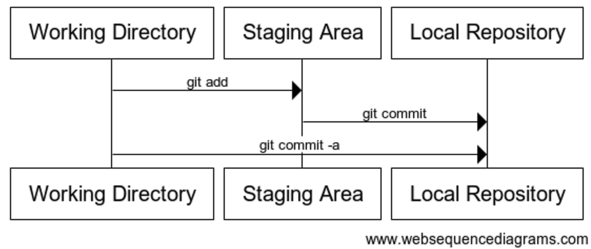
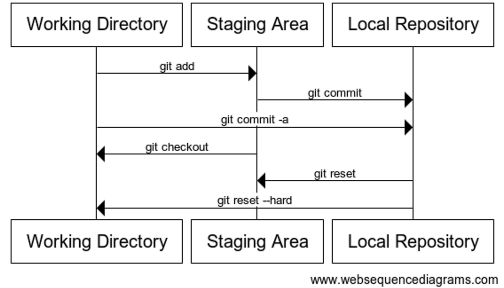
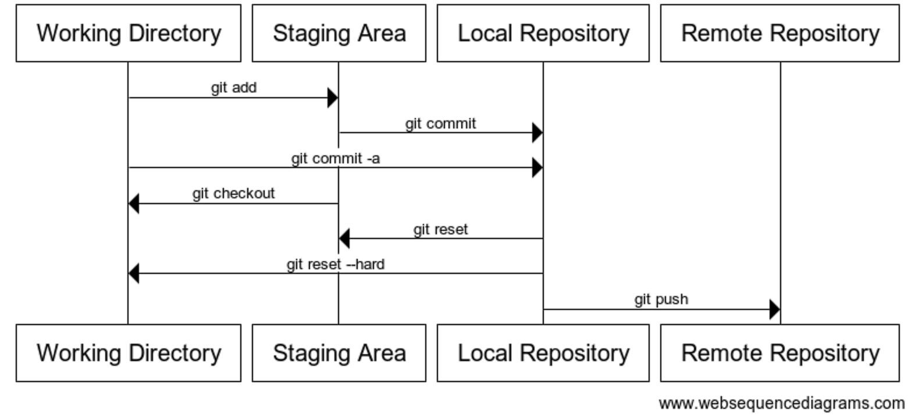
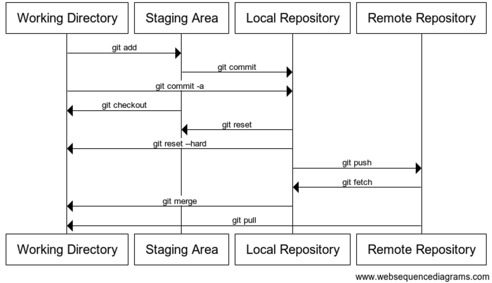

# Version Control

[Git-Cheatsheet](Git-Cheatsheet.pdf)

## Introduction to Version Control

### What's version control?

Version control is a tool for __managing changes__ to a set of files.

There are many different __version control systems__: 

- Git 
- ...

### Why use version control?

- Better kind of __backup__.
- Review __history__ ("When did I introduce this bug?").
- Restore older __code versions__.
- Ability to __undo mistakes__.
- Maintain __several versions__ of the code at a time.

### Git != GitHub

- __Git__: version control system tool to manage source code history.

- __GitHub__: hosting service for Git repositories.

## Solo Git

### The Levels of Git

Let's make ourselves a sequence chart to show the different aspects of Git we've seen so far:

## Fixing mistakes

### Resetting the working area

When `git reset` removes commits, it leaves your working directory unchanged -- so you can keep the work in the bad change if you want. 

## Publishing

### Remotes

The first command sets up the server as a new `remote`, called `origin`. 

Git, unlike some earlier version control systems is a "distributed" version control system, which means you can work with multiple remote servers. 

Usually, commands that work with remotes allow you to specify the remote to use, but assume the `origin` remote if you don't. 

Here, `git push` will push your whole history onto the server, and now you'll be able to see it on the internet! Refresh your web browser where the instructions were, and you'll see your repository!

## Collaboration

### The Levels of Git

