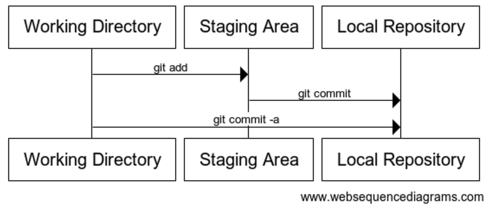
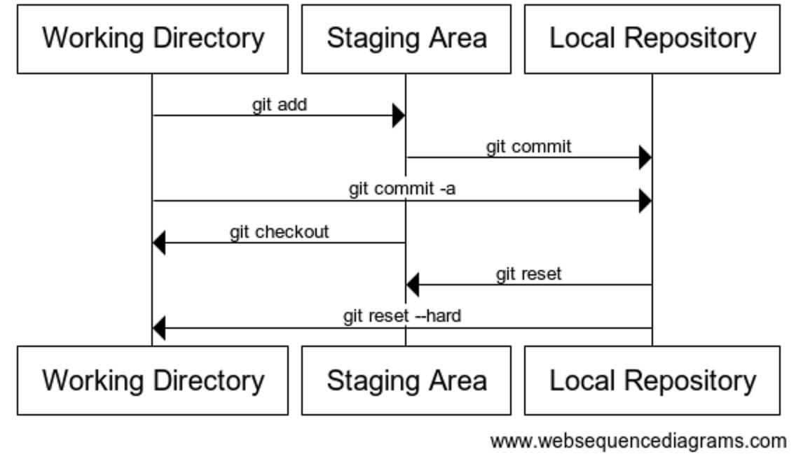
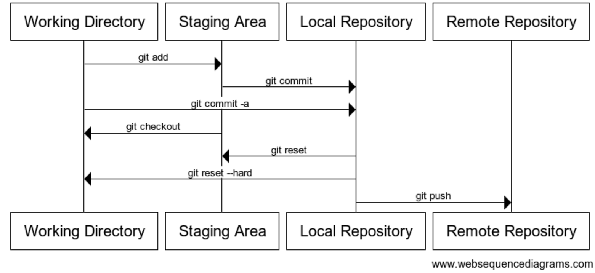
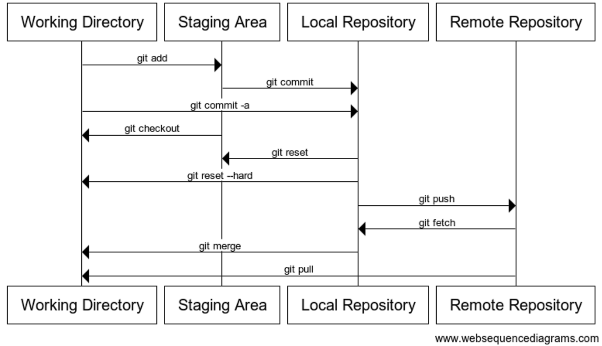

# Git

[Git-Cheatsheet](Git-Cheatsheet.pdf)

## Git Diagrams

[01_git_init_wrong_place](01.pdf)

[02_git_and_a_bad_commit](02.pdf)

[03_git_local_and_remote](03.pdf)

[04_two_people_and_one_remote](04.pdf)

[05_contribute_via_pull_requests](05.pdf)

## Introduction to Version Control

### What's version control?

Version control is a tool for __managing changes__ to a set of files.

There are many different __version control systems__: 

- Git 
- ...

### Why use version control?

- Better kind of __backup__.
- Review __history__ ("When did I introduce this bug?").
- Restore older __code versions__.
- Ability to __undo mistakes__.
- Maintain __several versions__ of the code at a time.

### Git != GitHub

- __Git__: version control system tool to manage source code history.

- __GitHub__: hosting service for Git repositories.

## Solo Git

### The Levels of Git

Let's make ourselves a sequence chart to show the different aspects of Git we've seen so far:

## Fixing mistakes

### Resetting the working area

When `git reset` removes commits, it leaves your working directory unchanged -- so you can keep the work in the bad change if you want. 

## Publishing

### Remotes

The first command sets up the server as a new `remote`, called `origin`. 

Git, unlike some earlier version control systems is a "distributed" version control system, which means you can work with multiple remote servers. 

Usually, commands that work with remotes allow you to specify the remote to use, but assume the `origin` remote if you don't. 

Here, `git push` will push your whole history onto the server, and now you'll be able to see it on the internet! Refresh your web browser where the instructions were, and you'll see your repository!

## Collaboration

### The Levels of Git

## Fork and Pull

### Team up!

1. Fork repository
2. Clone your forked repo -- **git clone**
3. Create a feature branch -- **git switch -c**
4. Make, commit and push changes to new branch -- **git add & git commit -m & git push**
5. Create Pull Request
6. Feedback from team leader
7. Fixes by collaborator
8. Leader accepts pull request

## 杂项

### Working with generated files: gitignore

We often end up with files that are generated by our program. It is bad practice to keep these in Git. 

Use `.gitignore` files to tell Git not to pay attention to files with certain paths, just keep the sources.

### The gh-pages branch

GitHub creates github pages when you use a special named branch.

This is best used to create documentation for a program you write, but you can use it for anything.

## Rebase

**Rebase = 重新整理提交历史**

它的作用是：
> 把当前分支的提交“移动”到另一个分支的最新位置上，使提交历史变成一条直线。

## Bisect

**git bisect = 用二分查找定位 bug 的提交**

👉 当你知道：
- 现在版本是 ❌（有 bug）
- 过去某个版本是 ✅（正常）

Git 可以帮你自动缩小范围，快速找到“第一个出问题的 commit”。