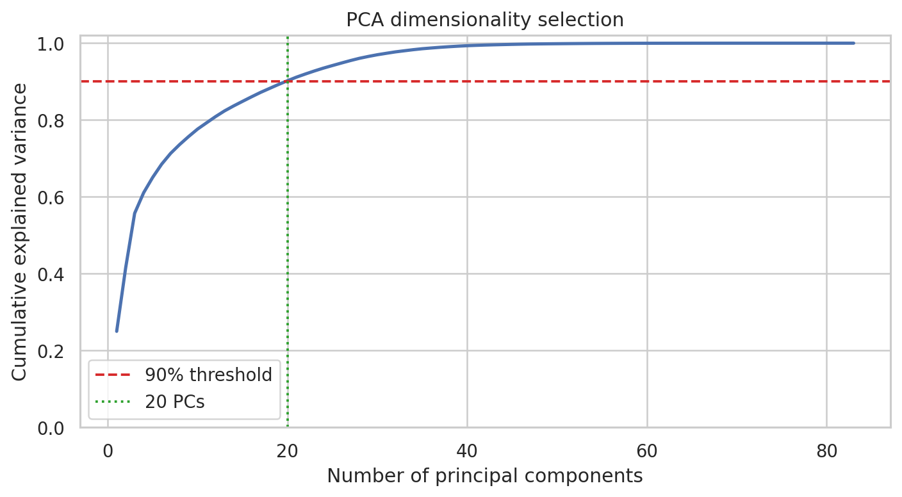
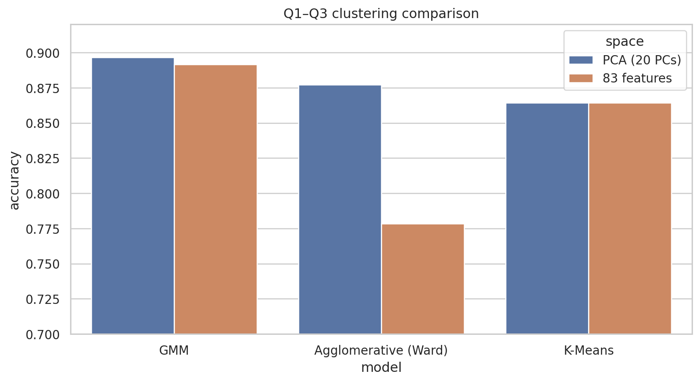
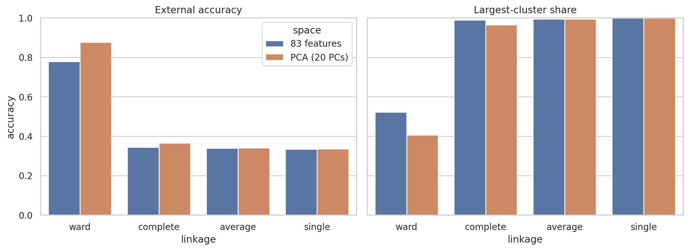
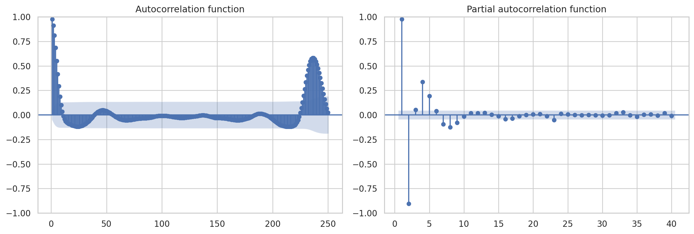
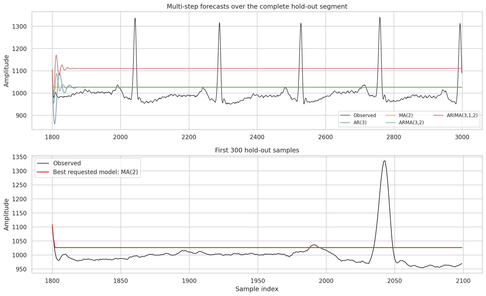

# ECG聚类、时序预测与心血管疾病关联分析

> 一个覆盖无监督学习、时间序列与可解释模式挖掘的综合课程项目：对83维ECG特征进行聚类比较，对单导联ECG进行时序建模，并从心血管数据中提取关联规则。

## 项目概览

| 模块 | 数据 | 核心方法 | 主要结果 |
|---|---|---|---|
| ECG无监督聚类 | 1,800条、83维、3个平衡类别 | StandardScaler、PCA、K-Means、GMM、层次聚类、匈牙利对齐 | GMM+PCA准确率**89.67%** |
| ECG时间序列 | 3,000个采样点 | ADF、季节分解、ACF/PACF、AR/MA/ARMA/ARIMA | MA(2)在候选模型中RSS最低 |
| 心血管关联规则 | 270条记录、15个二值项 | Apriori、Support、Confidence、Lift、Conviction | 31条疾病存在高确信度规则 |

独立脚本见[`Q1.py`](../../src/CW4/Q1.py)、[`Q2.py`](../../src/CW4/Q2.py)、[`Q3.py`](../../src/CW4/Q3.py)和[`Q4.py`](../../src/CW4/Q4.py)；完整叙述和Apriori分析保存在本地`CW4.ipynb`。

## 第一部分：ECG无监督聚类

### 数据与评估方法

数据包含1,800条ECG特征记录，三个类别各600条，共83个连续特征且无缺失值。处理步骤为：

1. 对83维特征进行零均值、单位方差标准化；
2. 在标准化空间拟合PCA，选择累计解释方差不低于90%的最少主成分；
3. 分别在原始83维空间和PCA空间训练K-Means、GMM和层次聚类；
4. 聚类完成后，使用匈牙利算法寻找“簇编号—真实类别”的全局最优一对一映射；
5. 在统一映射下计算Accuracy、Weighted Precision/Recall/F1和混淆矩阵。

匈牙利算法只用于事后评价，不参与训练，也不会改变聚类本身。它解决的是无监督簇编号任意的问题，防止直接比较数字标签导致错误评分。

### PCA结果

20个主成分保留了**90.213%**的方差，相比83维减少约76%的维数。PCA后K-Means的分配与原空间完全相同，说明其主要聚类结构可以由较低维线性子空间表达。

### 模型对比

| 模型 | 特征空间 | Accuracy | Weighted F1 |
|---|---|---:|---:|
| GMM | PCA 20维 | **89.67%** | **0.8928** |
| GMM | 原始83维 | 89.17% | 0.8872 |
| Ward层次聚类 | PCA 20维 | 87.72% | 0.8754 |
| K-Means | 原始/PCA | 86.44% | 0.8584 |
| Ward层次聚类 | 原始83维 | 77.83% | 0.7619 |

GMM允许每个簇具有完整协方差，能表达比K-Means球形簇更灵活的椭球结构；PCA后准确率再提高0.5个百分点，可能来自低方差噪声的去除和协方差估计稳定性的改善。类别1仍是主要错误来源，说明该类在当前特征空间与另外两类存在较强形态重叠。

### Linkage敏感性

Ward是唯一具有竞争力的层次聚类方法。Complete、Average和Single都将96%以上的样本放入最大簇；Single在原空间中更将1,798/1,800条记录合并为一簇，呈现典型的**chaining effect**。这也解释了为什么不能只看Weighted Precision：当类别坍缩时，该指标可能看似较高，而Accuracy、F1、混淆矩阵和簇规模共同揭示了失败。

### 聚类结果的边界

89.67%是对同一批数据完成聚类后，经匈牙利算法对齐得到的外部评价，不是监督分类器在独立测试集上的泛化准确率。更严格的延伸应加入不同随机种子、bootstrap稳定性、轮廓系数，以及患者级留出验证。

## 第二部分：ECG时间序列

### 平稳性判断

原文件首个值0被视为采集伪影并删除。ADF检验结果为：

| 变换 | ADF Statistic | p-value | 5%结论 |
|---|---:|---:|---|
| 原始序列 | -11.074 | 4.47×10⁻²⁰ | 拒绝单位根 |
| 一阶差分 | -14.896 | 1.53×10⁻²⁷ | 拒绝单位根 |
| 平方根 | -6.808 | 2.16×10⁻⁹ | 拒绝单位根 |
| 对数 | -5.765 | 5.57×10⁻⁷ | 拒绝单位根 |

原始信号已经通过ADF平稳性检验，因此最终保留原始幅值建模。不能仅因为差分后的ADF统计量更负，就对已平稳序列继续差分；不必要的差分会放大噪声并降低预测的物理可解释性。

ACF显示较长的相关结构和重复峰值，PACF的主要直接影响集中于较小滞后。基于这些诊断，比较AR(3)、MA(2)、ARMA(3,2)和ARIMA(3,1,2)。前1,800点训练，后1,200点作为时间留出集。

### 预测结果

| 模型 | RSS | RMSE | MAE |
|---|---:|---:|---:|
| MA(2) | **4,695,514** | **62.55** | **47.35** |
| 训练均值基线 | 4,701,106 | 62.59 | 47.42 |
| ARMA(3,2) | 4,736,041 | 62.82 | 47.56 |
| AR(3) | 4,820,743 | 63.38 | 47.72 |
| ARIMA(3,1,2) | 18,865,419 | 125.38 | 122.64 |

MA(2)是四个指定候选中RSS最低的模型，但只比训练均值基线降低约0.12%。从图中可以看到，所有长跨度预测都很快回归至平滑水平，无法重现ECG尖峰的出现时间和幅度。因此准确表述应是“候选模型中误差最低”，而不是“能够准确预测ECG波形”。ARIMA的`d=1`对已经平稳的原始序列引入了不必要的积分项，表现明显最差。

## 第三部分：Apriori关联规则

心血管数据包含270条记录，疾病存在比例为44.4%。连续或多类别特征按课程阈值转换为15个布尔项，其中疾病存在和疾病缺失分别独热编码。

筛选流程：

- Apriori最小支持度0.25，得到175个频繁项集；
- 规则最小提升度1.15，得到482条候选规则；
- 加入确信度`conviction > 1.5`后剩余257条强规则；
- 严格限定后件为单一`class_present`时，得到**31条疾病存在规则**。

代表性规则如下：

| 前件 → 后件 | Support | Confidence | Lift | Conviction |
|---|---:|---:|---:|---:|
| 非零主要血管数 & 男性 → 疾病存在 | 0.252 | 0.829 | **1.866** | **3.254** |
| ST压低 & 非正常thal & 较高胸痛类别 → 疾病存在 | 0.267 | 0.809 | 1.820 | 2.908 |
| 非正常thal & 较高胸痛类别 → 疾病存在 | 0.296 | 0.792 | 1.782 | 2.672 |
| 最大心率>140 → 疾病缺失 | 0.467 | 0.670 | 1.206 | 1.348 |

第一条规则覆盖25.2%的全部记录；在满足前件的记录中，82.9%为疾病存在，其发生比例是总体疾病基线的1.866倍。第三条去掉ST压低后覆盖率上升，但Confidence和Conviction下降，体现了规则覆盖范围与特异性之间的取舍。

这些规则反映的是共现关系，不是因果关系或临床诊断依据。规则数量还会受到阈值、目标比例、相关特征和最小支持度裁剪的影响，需要外部队列验证。

## 项目价值

该项目的价值不只是运行了多种算法，而是针对每个问题选择了相应的评价纪律：

- 聚类标签无序，因此用匈牙利算法进行全局一对一对齐；
- 层次聚类不能只报Accuracy，还要检查簇规模以发现chaining和cluster collapse；
- 时间序列不能只看ADF或RSS，还需要观察预测波形是否保留关键尖峰；
- 关联规则必须同时解释Support、Confidence、Lift与Conviction，并明确“相关不等于因果”。

## 后续改进

- 聚类：加入内部指标、重采样稳定性和患者级独立验证；
- 时序：尝试滚动一步预测、显式周期/心拍对齐、状态空间或深度序列模型；
- 关联规则：去除冗余规则、进行多重比较控制，并在外部临床数据上验证。
