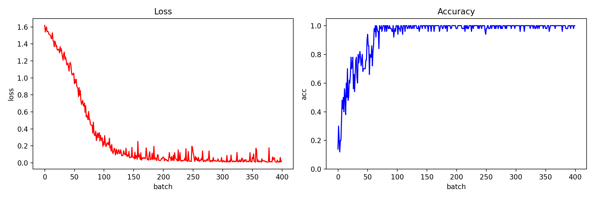
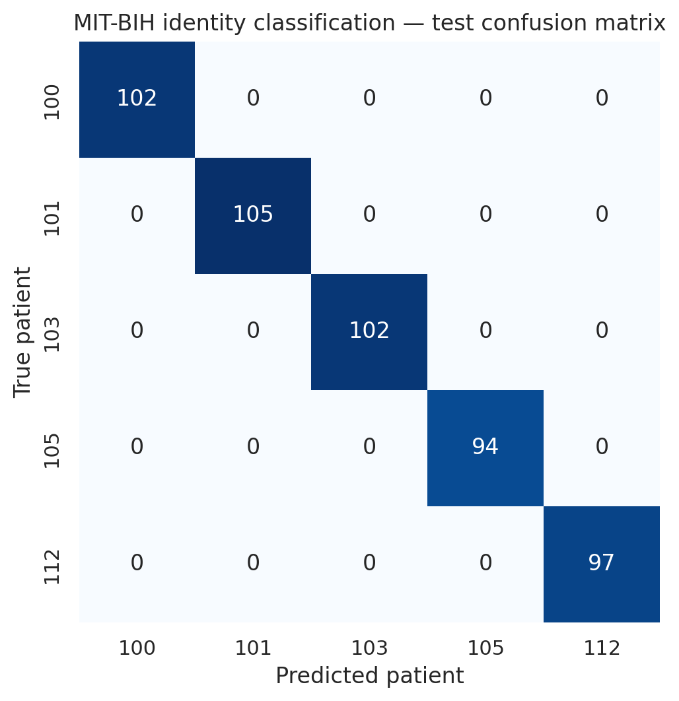

# 可穿戴设备健康监测中的ECG个体识别

> 使用MIT-BIH中五位受试者的ECG记录，围绕R峰截取固定长度心拍，并以PyTorch 1D-CNN完成已知受试者身份分类。

## 项目结论

| 项目 | 结果 |
|---|---:|
| 受试者 | 5人（100、101、103、105、112） |
| 有效心拍 | 5,000条，每人1,000条 |
| 单条输入 | 260个采样点，约0.72秒 |
| 数据划分 | 4,000 / 500 / 500（训练/验证/测试） |
| 测试交叉熵 | 0.01425 |
| 测试准确率 | **100.00%（500/500）** |
| Weighted F1 | **1.000** |

简历中“留出测试集准确率99%以上”是对当前结果的保守表述。这里的任务是从五个已知身份中识别心拍来源，并不代表模型可以识别训练时未见过的新受试者。

## 数据与处理流程

实现见 [`src/ECG.py`](../../src/ECG.py)。代码读取每位受试者的R峰标注文件和MLII导联：

1. 从每位受试者的标注中选取1,000个R峰；
2. 以R峰为中心向前、向后各截取130点，形成长度260的心拍窗口；
3. 对每个窗口单独进行Min-Max归一化，将幅值映射到`[-1, 1]`；
4. 固定随机种子42打乱5,000条心拍，并按8:1:1划分训练、验证和测试集；
5. 将数据整理为`[batch, 1, 260]`输入1D-CNN。

逐窗口归一化削弱了绝对幅值差异，使模型更集中地学习QRS波群和整体心拍形态。需要注意，数据划分发生在心拍层面，因此同一受试者的不同心拍会同时出现在训练集和测试集中。

## 模型设计

网络由三组`Conv1d + ReLU + MaxPool1d`构成，通道数依次为1→5→10→20；卷积输出展平后经过30和20单元的全连接层，最终输出五个身份类别。

训练配置：

| 配置 | 取值 |
|---|---:|
| 损失函数 | Cross-Entropy |
| 优化器 | SGD |
| 学习率 | 0.003 |
| Momentum | 0.7 |
| Batch size | 50 |
| Epochs | 5 |
| 权重初始化 | Kaiming Normal |

## 训练结果

**图像解读：** 前约100个batch中，损失由约1.6快速下降至0.3以下，batch准确率同步升至接近100%；后续损失继续下降并维持较低水平。训练曲线说明模型能够快速拟合五位受试者的形态差异，但该图仅展示训练batch，不应单独作为泛化能力证据，因此还需查看独立测试划分。

保存的`ECG_Recognition.pt`使用相同代码和随机种子重建测试集后，得到以下混淆矩阵：

五个类别的测试支持度分别为102、105、102、94和97，所有样本均落在对角线上。该结果支持“模型对这五位已知受试者具有很强区分能力”，而不是“能够泛化到任意新受试者”。

## 为什么这个任务可行

ECG包含与个体相关的稳定形态特征，例如QRS宽度、波形相对位置和局部形状。R峰对齐减少了相位差异，逐窗口归一化减少了幅值尺度变化，卷积层则从短局部模式逐步组合出更高层的心拍形态表示。

## 工程实现亮点

- 将RR标注时间映射至采样索引，并处理边界不足260点的异常窗口；
- 支持CPU/GPU自动切换、固定随机种子和模型参数持久化；
- 使用模块化的数据加载、训练、验证和测试函数；
- 用Kaiming初始化匹配ReLU网络，并保存训练曲线与`state_dict`。

## 局限性与下一步

- **心拍级而非受试者级划分：** 相邻心拍可能高度相关，当前测试分数可能高估真实跨时段表现；更严格的实验应按记录时间块或采集session划分。
- **封闭集身份识别：** 五个身份均在训练阶段出现，无法回答新身份注册或开放集拒识问题。
- **样本范围较小：** 只有五位受试者，尚不足以证明大规模可穿戴设备部署能力。
- **缺少鲁棒性实验：** 可进一步加入噪声扰动、跨导联、跨时间段和不同窗口长度的敏感性分析。
