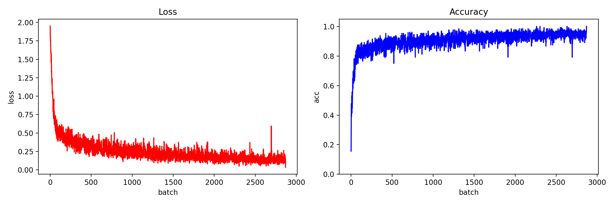
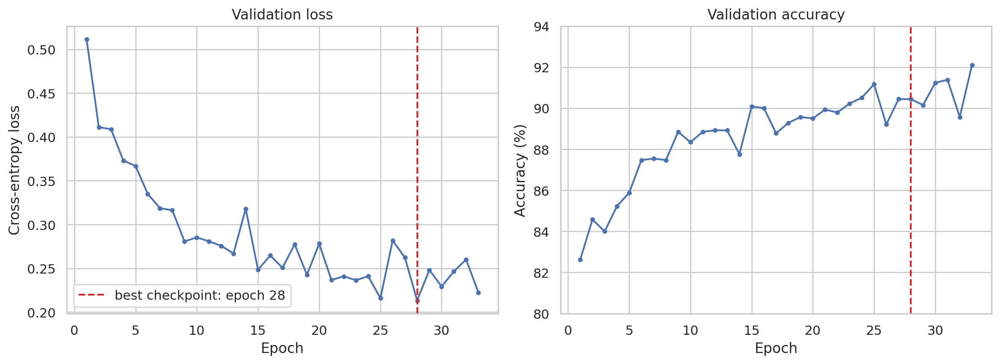
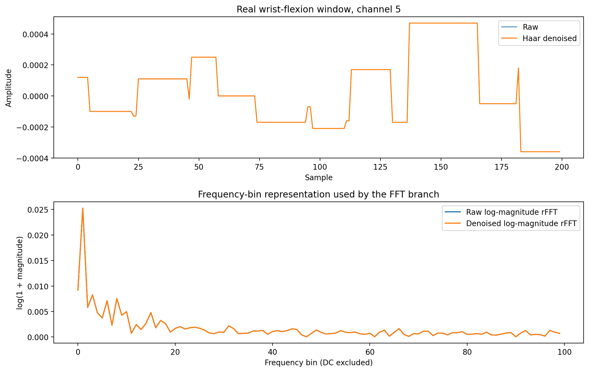
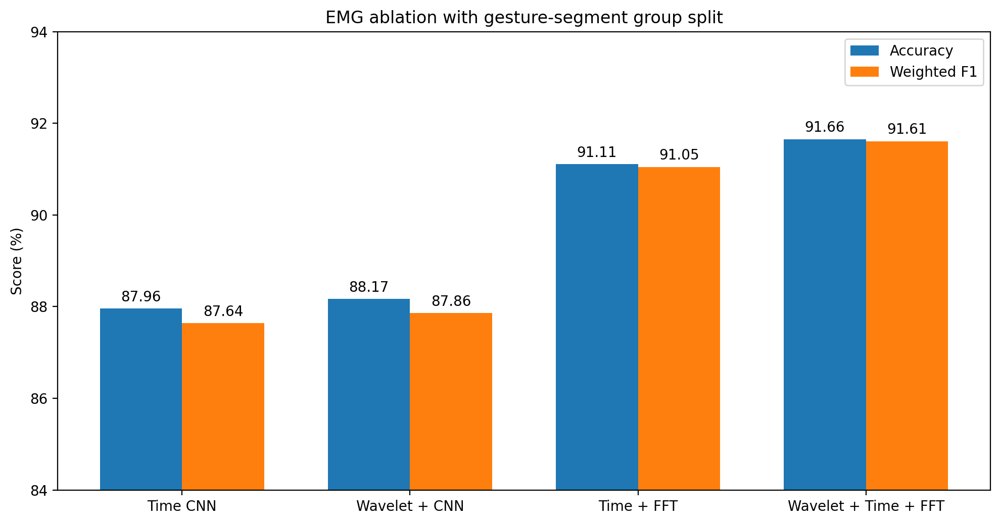
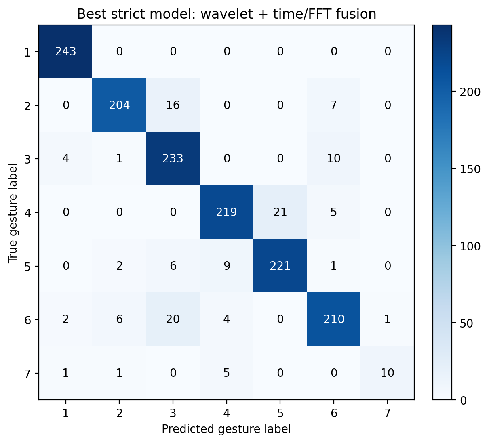
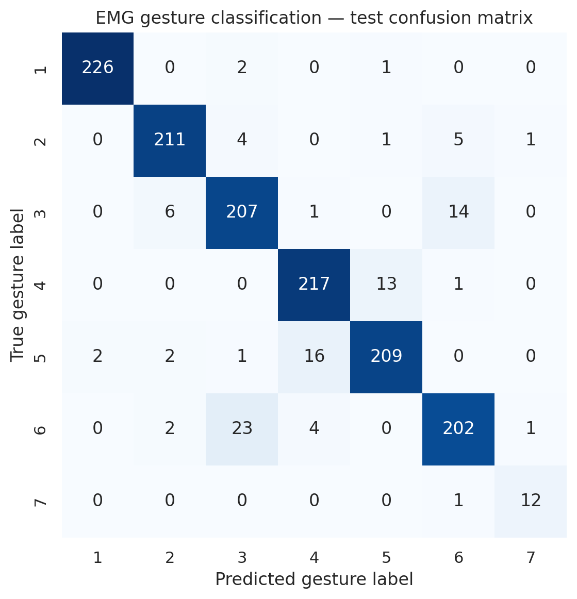

# 肌电信号处理与手势识别

> 基于36名受试者的八通道表面肌电数据，将连续手势片段切分为固定窗口，并融合Haar小波去噪、时域1D-CNN与FFT频域分支完成七类手势识别。

## 项目结论

| 项目 | 结果 |
|---|---:|
| 数据来源 | EMG Pattern Database，36名受试者 |
| 传感器 | MYO臂环，8通道 |
| 有效类别 | 7类手势，不包含未标注类别0 |
| 窗口/步长 | 200 / 100采样点 |
| 有效窗口 | 13,822 |
| 严格分组划分 | 11,020 / 1,340 / 1,462，手势段交集为0 |
| 分组时域CNN | 87.96% Accuracy / 0.8764 F1 |
| 分组小波+时域+FFT | **91.66% Accuracy / 0.9161 F1** |
| 原窗口级时域CNN | 92.71% Accuracy / 0.9271 F1 |
| 原窗口级小波+时域+FFT | **94.66% Accuracy / 0.9466 F1** |

原实验指标保存在`results/EMG/summary.json`，时频消融保存在`results/EMG/ablation/comparison.csv`，可复现实现见[`src/EMG.py`](../../src/EMG.py)。分组结果是更严格的主结论；窗口级结果用于与原92.71%口径兼容，不应混为同一评估条件。

## 数据处理流程

原始数据包含36名受试者的两轮采集，每条记录含时间、八个EMG通道和手势标签。当前可复现流程为：

1. 读取72个原始文本文件，删除包含缺失值的记录；
2. 默认排除标签0的未标注/动作间隔数据；
3. 按标签连续不变的手势段切分，避免单个窗口跨越手势边界；
4. 在每个连续片段内部以200点窗口、100点步长生成`[8, 200]`样本；
5. 为每个“原始文件+连续手势片段”分配唯一group，将整个group放入同一集合，并按类别近似8:1:1划分；
6. 仅使用训练集计算各通道均值和标准差，再应用到验证集和测试集，避免统计量泄漏。

严格消融使用696/85/91个训练/验证/测试手势段，三组之间交集均为0，从而避免50%重叠窗口跨集合。代码仍保留`--split-mode window`用于复现原窗口级实验。

## 模型设计与训练

1D-CNN直接把八个电极作为输入通道：

- 三层卷积：8→32→64→128，卷积核依次为7、5、3；
- 每层配合Batch Normalization和ReLU，前两层使用最大池化；
- Adaptive Average Pooling将不同时间位置的信息汇总为128维表示；
- 全连接层为128→64→7，并使用`Dropout(0.2)`；
- 采用Cross-Entropy、Adam（学习率0.001）和batch size 128；
- 最多训练50轮，验证损失连续5轮不改善则早停，并恢复验证损失最低的权重。

新增时频模块均可通过命令行开关控制：

- **小波去噪：** 对每个窗口、每个通道执行三级Haar离散小波分解，根据最细尺度细节系数的MAD估计噪声，采用0.5倍通用软阈值，再等长重构；
- **FFT分支：** 在模型内部计算`log1p(abs(rFFT))`并去除DC分量，经32→64通道的频域卷积网络提取表示；
- **特征融合：** 将128维时域表示与64维频域表示拼接，再输入64单元全连接分类器。

严格分组最佳模型可通过以下命令复现：

```bash
python src/EMG.py --split-mode group --wavelet-denoise --fft-branch \
  --epochs 40 --early-stopping-patience 5 \
  --results-dir results/EMG/ablation/group_wavelet_fft
```

## 训练与早停结果



Batch级训练损失快速下降，训练准确率逐渐稳定在较高水平；曲线保留了随机mini-batch造成的波动，没有经过平滑处理。



验证损失在第28轮达到最低值0.2133。训练继续到第33轮后触发Early Stopping，并恢复第28轮模型，而不是选择验证准确率偶然最高的后期epoch。这个策略用独立于测试集的验证损失控制模型选择。

## 时频消融实验



上图来自真实腕屈窗口。小波软阈值保留了主要时域形态，FFT分支则显式暴露不同频率bin的能量分布。由于本数据的幅值量化明显，原始与去噪曲线高度重合，这与“小波单独增益有限”的实验结果一致。



| 严格手势段分组实验 | Accuracy | Weighted F1 | 相对时域CNN |
|---|---:|---:|---:|
| 时域CNN | 87.96% | 87.64% | — |
| Haar小波 + 时域CNN | 88.17% | 87.86% | +0.21个百分点 |
| 时域CNN + FFT分支 | 91.11% | 91.05% | +3.15个百分点 |
| Haar小波 + 时域CNN + FFT | **91.66%** | **91.61%** | **+3.69个百分点** |

结果表明主要提升来自FFT分支；小波单独只提高0.21个百分点，在FFT基础上再提高0.55个百分点。因而可以说“时频融合改善了分类”，但不应把全部提升归因于小波去噪。

在原窗口级划分下，小波+时域+FFT达到**94.66%**，高于原时域CNN的92.71%。两者差距同时说明：时频特征有效，但允许同一手势段的重叠窗口跨集合会产生更乐观的分数。

## 测试结果与错误分析



严格分组最佳模型在1,462个测试窗口中正确识别1,340个。静息类别243/243全部正确；主要错误仍集中于动作相似类别，例如20个尺偏窗口被识别为腕屈、21个腕伸窗口被识别为桡偏。伸掌测试group较少，因此其估计仍不稳定。

以下是原窗口级时域CNN的结果，用于对应历史92.71%基线：



标签与手势对应关系：1静息，2握拳，3腕屈，4腕伸，5桡偏，6尺偏，7伸掌。

| 手势 | Support | Precision | Recall | F1 |
|---|---:|---:|---:|---:|
| 静息 | 229 | 99.12% | 98.69% | 98.91% |
| 握拳 | 222 | 95.48% | 95.05% | 95.26% |
| 腕屈 | 228 | 87.34% | 90.79% | 89.03% |
| 腕伸 | 231 | 91.18% | 93.94% | 92.54% |
| 桡偏 | 230 | 93.30% | 90.87% | 92.07% |
| 尺偏 | 232 | 90.58% | 87.07% | 88.79% |
| 伸掌 | 13 | 85.71% | 92.31% | 88.89% |

静息和握拳最容易区分。最大单向混淆是23个尺偏窗口被判断为腕屈，另有16个桡偏窗口被判断为腕伸；这些动作在前臂肌群激活模式上较接近。伸掌仅有13个测试窗口，因为该动作并非所有受试者都执行，因此其指标方差会显著高于其他类别。

## 与原始探索Notebook的关系

原始`src/EMG.ipynb`记录了早期的数据读取、波形可视化、FFT、小波和KNN探索。当前`EMG.py`已经重新实现可训练的Haar小波预处理、`torch.fft.rfft`频域分支和严格分组消融，因此时频结论不再依赖原Notebook的探索单元。

当前使用的是Haar小波，并未实现Butterworth带通或50/60 Hz陷波，因此简历也应使用对应口径。原Notebook的KNN单元将真实标签错误地取自训练数组，其96.93%输出仍不能作为可靠基线，也不与1D-CNN做数值比较。

## 局限性与下一步

- 当前已按连续手势段分组；下一步应进一步按**受试者或session划分**，检验跨用户、跨次采集泛化；
- 补充规范实现的KNN/SVM/随机森林基线，并在相同划分上比较；
- 若采样率与工频信息明确，再加入带通及50/60 Hz陷波消融，并把频率bin转换为可解释的Hz频带；
- 针对伸掌类别进行重采样、类别权重或宏平均指标评估。
