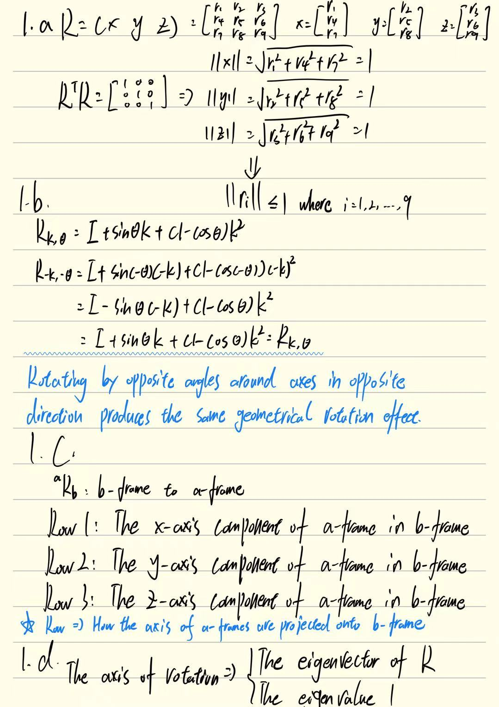
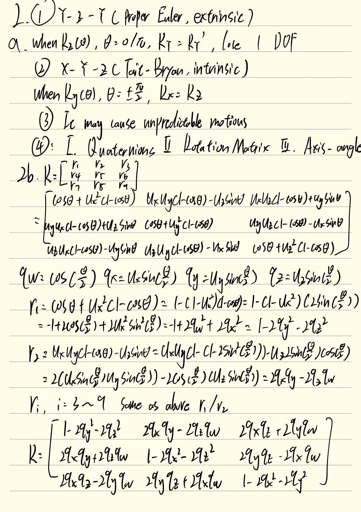
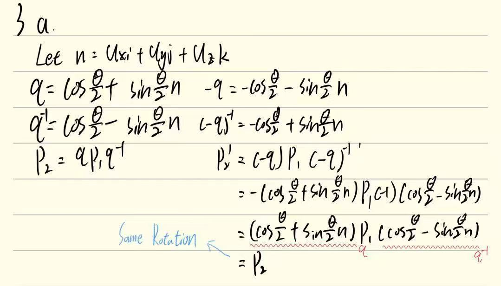

# MPHY0054 Coursework 1
## Linear Algebra
### Q1
#### a b c d 

### Q2
#### a b

#### c
* Nano-robot with limited memory storage: Axis-angle/Euler Angles -> Minimal storage(3 parameters)
* Nno-robot with limited computational power: Euler Angles -> Very easy logic, no heavy math(trigonometric)
* Iphone navigation system: Quaternions -> No discontinuities and Gimbal lock, parameters less than Rotate Matrix
* Robotic arm with 6 DOF: Rotation Matrix -> D-H(built on matrix), easy for FK/IK
### Q3
#### a

#### b
In general, RaRb != RbRa,
But there are several special cases where RaRb = RbRa
1. The rotation axes are the same:
   * Ra = R(x,θa)
   * Rb = R(x,θb)
2. One of the R is the identity matrix: IR = RI
3. The θ = 0°/180°, and the axes are orthogonal
